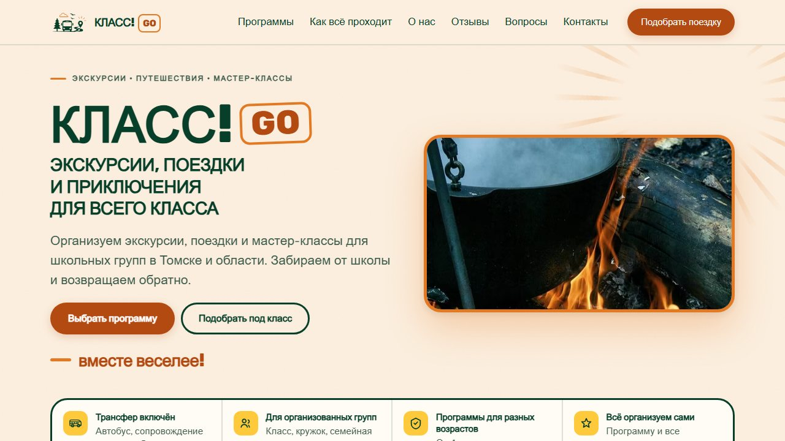

<!-- ══════════════════════════ HEADER ══════════════════════════ -->
<p align="center">
  
</p>

<p align="center">
  <a href="https://github.com/syntaxixr">
    
  </a>
</p>

<p align="center">
  <a href="https://t.me/synaps_ss"></a>
  
</p>

<!-- ══════════════════════════ ABOUT ══════════════════════════ -->


###  &nbsp;About me

```ts
const syntaxixr = {
  role:      "Programmer & vibecoder",
  base:      "solid fundamentals — I understand what the code does",
  workflow:  "most of the code is written together with AI",
  copilots:  ["Claude", "GLM", "DeepSeek"],
  buildsFor: ["Telegram bots", "server automation", "websites", "IoT dashboards"],
  stack:     ["Python", "JavaScript", "Electron", "Linux", "Docker"],
  motto:     "idea today → working product tonight",
};
```

- 🟣 I turn ideas into working things **fast** — AI writes, I architect, review and ship
- 🤖 Building **Telegram bots**, automations and self-hosted services on my own VDS
- 🌐 Making **websites** with motion and attention to detail
- 📡 Right now: industrial IoT monitoring — MQTT, time-series DB, alerts in Telegram

<!-- ══════════════════════════ STACK ══════════════════════════ -->


### ⚡ &nbsp;Stack

<p align="center">
  
  <br/>
  
</p>

### 🧠 &nbsp;AI copilots

<p align="center">
  
  
  
  
  
</p>

<!-- ══════════════════════════ PROJECTS ══════════════════════════ -->


### 🚀 &nbsp;Projects

<p align="center">
  <a href="https://github.com/syntaxixr/OrbSniper">
    
  </a>
  <br/>
  <sub><b>OrbSniper</b> — Electron app that farms Discord Orbs: accepts, completes and claims Quests while you're away.</sub>
</p>

<table align="center">
  <tr>
    <td align="center" width="50%">
      <a href="https://klassgo.ru"></a>
      <br/><b><a href="https://klassgo.ru">klassgo.ru</a></b>
      <br/><sub>School trips &amp; excursions agency. Static site generator in Python, custom image pipeline, self-hosted.</sub>
    </td>
    <td align="center" width="50%">
      <a href="https://zhizntemy.ru"></a>
      <br/><b><a href="https://zhizntemy.ru">zhizntemy.ru</a></b>
      <br/><sub>Landing page for a documentary film. GSAP + ScrollTrigger animations, dark cinematic design.</sub>
    </td>
  </tr>
</table>

<!-- ══════════════════════════ STATS ══════════════════════════ -->


### 📊 &nbsp;GitHub stats

<p align="center">
  
  
</p>
<p align="center">
  
</p>
<p align="center">
  
</p>

<!-- ══════════════════════════ SNAKE ══════════════════════════ -->
<p align="center">
  <picture>
    <source media="(prefers-color-scheme: dark)" srcset="https://raw.githubusercontent.com/syntaxixr/syntaxixr/output/snake-dark.svg"/>
    <source media="(prefers-color-scheme: light)" srcset="https://raw.githubusercontent.com/syntaxixr/syntaxixr/output/snake-light.svg"/>
    
  </picture>
</p>

<!-- ══════════════════════════ FOOTER ══════════════════════════ -->
<p align="center">
  
</p>
